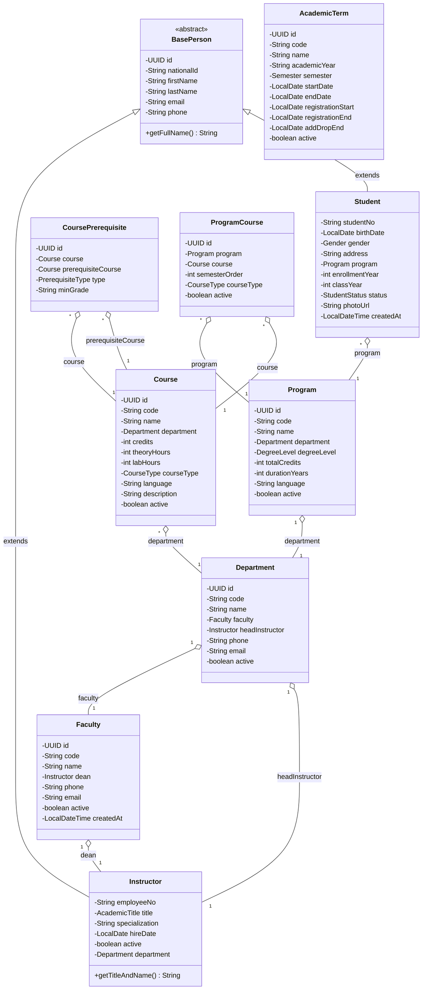
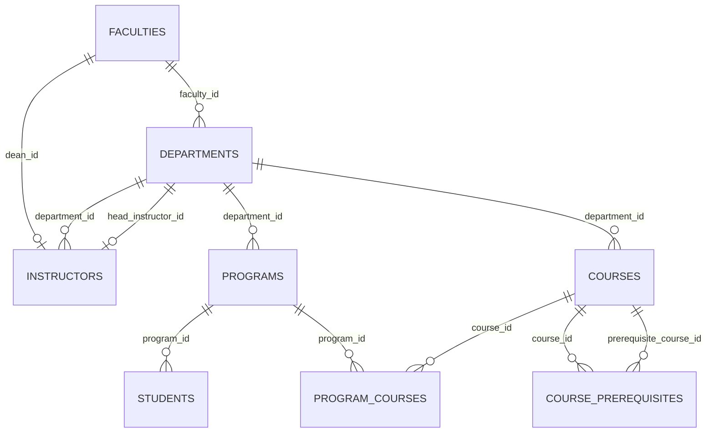

# 🎓 Student Information System (SIS)
### Software Design and Architecture (SDA) / Object Oriented Design — Assignment 1


---

## 👨‍🎓 Academic Metadata

- **Student:** Sude Hatkaoğlu
- **Course:** Software Design and Architecture (SDA) / Object Oriented Design
- **Instructor:** Prof. Dr. Ali Güneş
- **Assignment:** Assignment 1 — Student Information System Class Design

---

## 📝 About the Project

This project models a university's **Student Information System (SIS)**. It is developed in strict accordance with the relational database schema (ER Diagram) provided in the course assignment and implements Object-Oriented Programming (**OOP**) principles and **JavaBean** standards.

> 💡 **Version Note:** This repository will be continuously updated throughout the semester with subsequent assignments and features (database integration via JDBC/JPA, design patterns, layered service architecture, etc.). The current version represents the core domain model and initial registration simulation.

---

## 📐 Visual Architecture & Diagrams

### 1. 🏛️ UML Class Diagram (OOP Relationships)



---

### 2. 🗄️ Relational Entity-Relationship (ER) Diagram



> 📄 **SQL Schema:** Complete PostgreSQL / MySQL compatible DDL script is available in [docs/schema.sql](docs/schema.sql).

---

## 🌟 Features (Version 1.0)

- 🧱 **Full OOP Architecture & Inheritance:** Common personal identity fields (`id`, `nationalId`, `firstName`, `lastName`, `email`, `phone`) are abstracted into `BasePerson`, from which `Student` and `Instructor` inherit.
- 🔗 **Foreign Key Simulation:** Direct object references (`Association / Aggregation`) and `java.util.UUID` are utilized to model relational keys with realistic ID management.
- 📜 **Separated Enum Structures:** Domain enums (`Gender`, `CourseType`, `StudentStatus`, `AcademicTitle`, `DegreeLevel`, `Semester`, `PrerequisiteType`) are defined as dedicated types ensuring type safety.
- 👥 **Student Registration Simulation:** Students are dynamically registered into `ArrayList<Student>` and formatted with their program, department, faculty, and academic term details.
- 🛡️ **JavaBean Compliance:** `private` fields, public getters/setters, default and parameterized constructors, and custom `toString()` overrides across all 9 entities.

---

## 📂 Project Structure

```text
📦 student-information-system
 ┣ 📂 src
 ┃ ┣ 🏛️ Entity Classes
 ┃ ┃ ┣ 📄 BasePerson.java            # Abstract base class (Inheritance)
 ┃ ┃ ┣ 📄 AcademicTerm.java           # ACADEMIC_TERMS table
 ┃ ┃ ┣ 📄 Course.java                 # COURSES table
 ┃ ┃ ┣ 📄 CoursePrerequisite.java     # COURSE_PREREQUISITES table
 ┃ ┃ ┣ 📄 Department.java             # DEPARTMENTS table
 ┃ ┃ ┣ 📄 Faculty.java                # FACULTIES table
 ┃ ┃ ┣ 📄 Instructor.java             # INSTRUCTORS table (extends BasePerson)
 ┃ ┃ ┣ 📄 Program.java                # PROGRAMS table
 ┃ ┃ ┣ 📄 ProgramCourse.java          # PROGRAM_COURSES table
 ┃ ┃ ┗ 📄 Student.java                # STUDENTS table (extends BasePerson)
 ┃ ┃
 ┃ ┣ 🏷️ Enums
 ┃ ┃ ┣ 📄 AcademicTitle.java          # öğr.gör., dr., dr.öğr.üyesi, doç.dr., prof.dr.
 ┃ ┃ ┣ 📄 CourseType.java             # zorunlu, seçmeli, ASD
 ┃ ┃ ┣ 📄 DegreeLevel.java            # önlisans, lisans, yüksek_lisans, doktora
 ┃ ┃ ┣ 📄 Gender.java                 # E, K (MALE, FEMALE)
 ┃ ┃ ┣ 📄 PrerequisiteType.java       # ZORUNLU, ONERILEN
 ┃ ┃ ┣ 📄 Semester.java               # güz, bahar, yaz okulu
 ┃ ┃ ┗ 📄 StudentStatus.java          # aktif, mezun, kayıt donduruldu, ayrıldı
 ┃ ┃
 ┃ ┗ 🚀 Entry Point
 ┃   ┗ 📄 Main.java                   # Main simulation runner
 ┣ 📂 docs
 ┃ ┗ 📄 schema.sql                    # Full SQL DDL database schema
 ┣ 📂 out                             # Compiled bytecode (.class files)
 ┣ 📄 run.bat                         # 1-Click build & run script (Windows)
 ┣ 📄 run.sh                          # 1-Click build & run script (Linux/macOS)
 ┣ 📄 LICENSE                         # MIT License
 ┣ 📄 .gitignore                      # Git ignore rules for build artifacts
 ┗ 📄 README.md                       # Comprehensive documentation
```

---

## 🎯 Database Schema to Java OOP Mapping

| Database Table | Java Model Class | Inheritance / FK Relationship | Enum Fields |
| :--- | :--- | :--- | :--- |
| *(Common Person)* | `BasePerson` *(abstract)* | Base class for person entities | - |
| `INSTRUCTORS` | `Instructor` | `extends BasePerson`<br>`department` ➔ `Department` | `AcademicTitle` |
| `FACULTIES` | `Faculty` | `dean` ➔ `Instructor` | - |
| `DEPARTMENTS` | `Department` | `faculty` ➔ `Faculty`<br>`headInstructor` ➔ `Instructor` | - |
| `PROGRAMS` | `Program` | `department` ➔ `Department` | `DegreeLevel` |
| `STUDENTS` | `Student` | `extends BasePerson`<br>`program` ➔ `Program` | `Gender`, `StudentStatus` |
| `COURSES` | `Course` | `department` ➔ `Department` | `CourseType` |
| `COURSE_PREREQUISITES` | `CoursePrerequisite` | `course` ➔ `Course`<br>`prerequisiteCourse` ➔ `Course` | `PrerequisiteType` |
| `ACADEMIC_TERMS` | `AcademicTerm` | - | `Semester` |
| `PROGRAM_COURSES` | `ProgramCourse` | `program` ➔ `Program`<br>`course` ➔ `Course` | `CourseType` |

---

## 🚀 Installation & Usage

### Option 1: 1-Click Scripts

- **Windows:** Double-click [`run.bat`](run.bat) (or run `./run.bat` in PowerShell/CMD).
- **Linux / macOS:** Run `chmod +x run.sh && ./run.sh`.

---

### Option 2: Terminal Commands

1. **Compile the source code:**
   ```bash
   javac -encoding UTF-8 -d out src/*.java
   ```

2. **Run the program:**
   ```bash
   java -cp out Main
   ```

---

## 📊 Sample Output

```text
=== ÖĞRENCİ BİLGİ SİSTEMİ SİMÜLASYONU ===

Aktif Dönem: 2026-2027 Güz Dönemi (2026-2027 / Güz)
Ön Koşul Kuralı: SWE201 dersi için ön koşul -> SWE101 (Min Not: DD)

Program Müfredatı (ProgramCourse):
   * SWE-BS | Dönem: 1 -> Programlamaya Giriş
   * SWE-BS | Dönem: 3 -> Nesne Yönelimli Tasarım

--- Kayıt Edilen Öğrenci Listesi ---
Öğrenci: Sude Hatkaoglu (2026101001) | Program: Yazılım Mühendisliği Lisans Programı | Sınıf: 1 | Durum: Aktif
   * Cinsiyet              : Kadın
   * Bağlı Olduğu Fakülte  : Mühendislik Fakültesi
   * Fakülte Dekanı        : Prof. Dr. Ali Güneş
   * Kayıt Tarihi          : 2026-10-01T01:14:13.575426100
```

---

## 📤 Submission & Git Workflow

```bash
git remote add origin https://github.com/<YOUR_GITHUB_USERNAME>/<YOUR_REPOSITORY_NAME>.git
git push -u origin main
```
